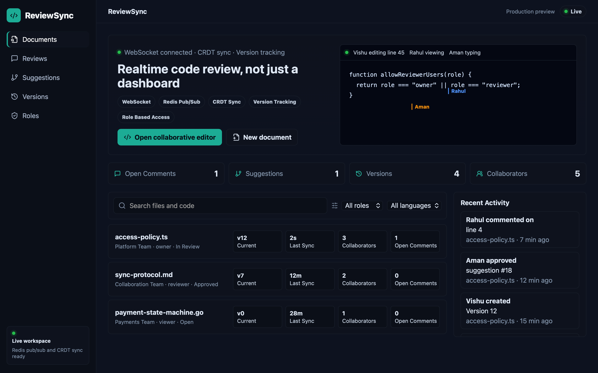
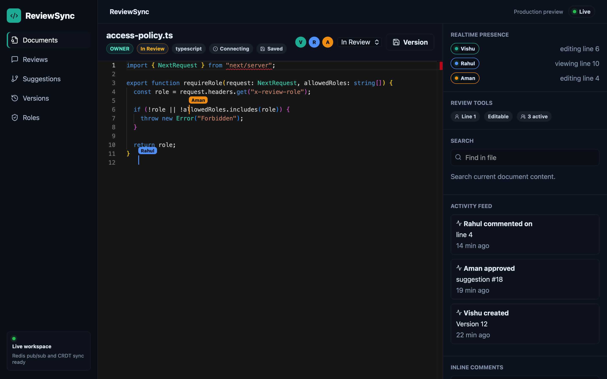
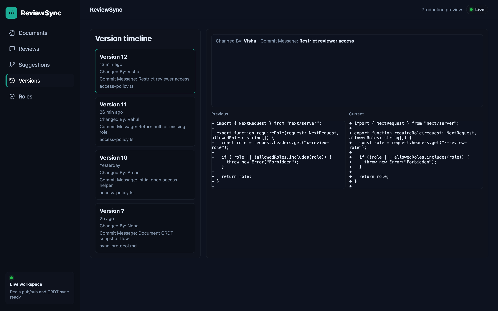
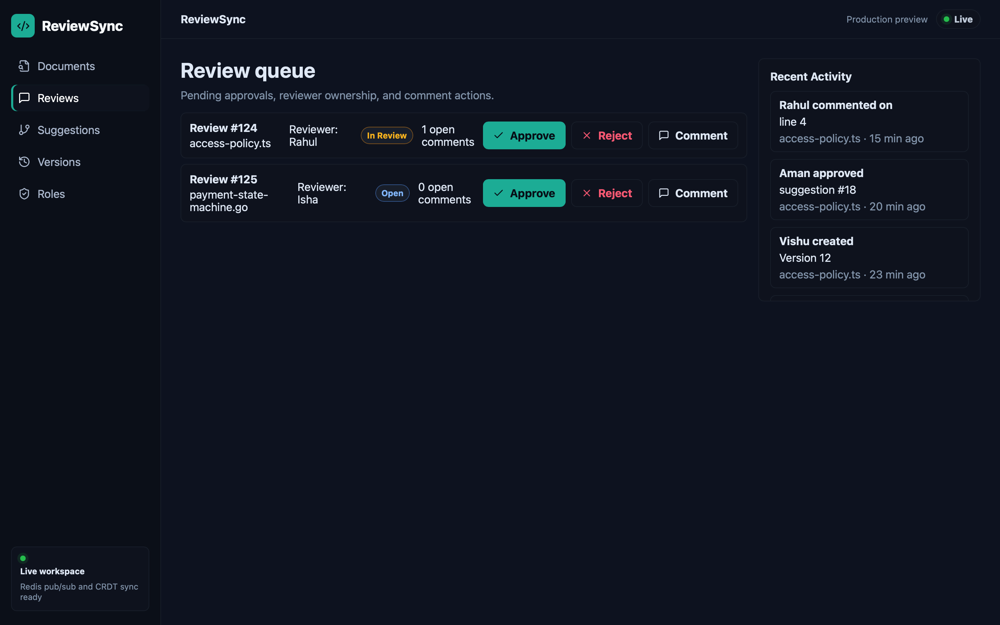
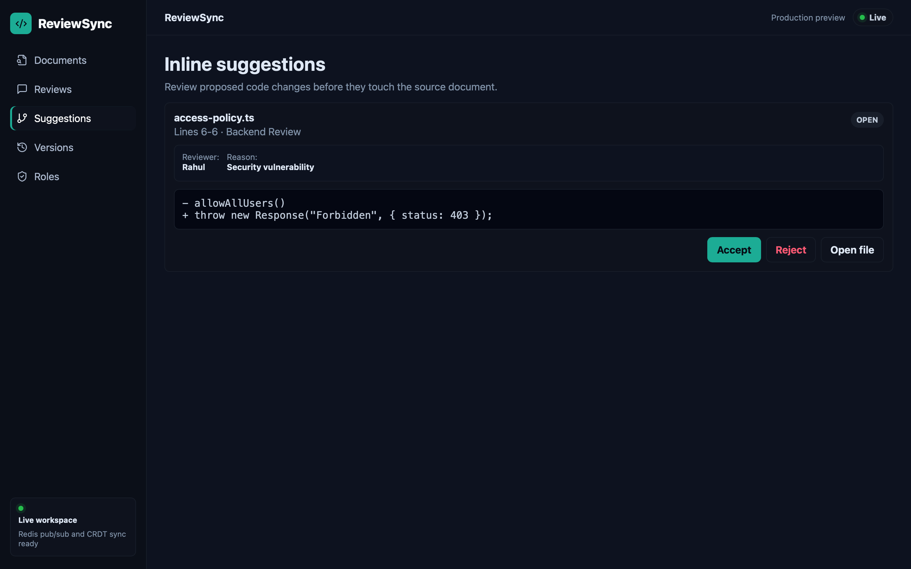
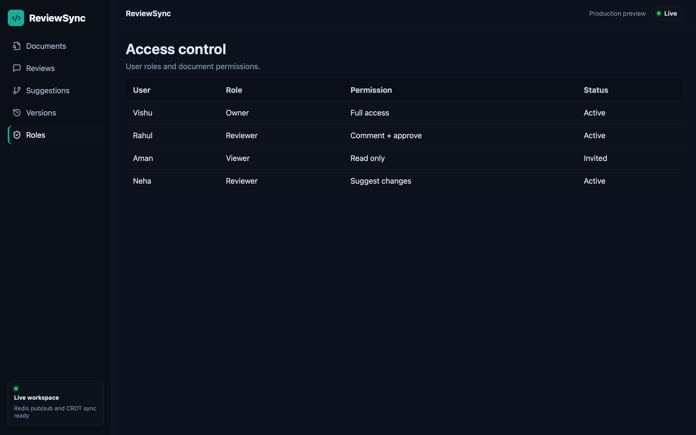
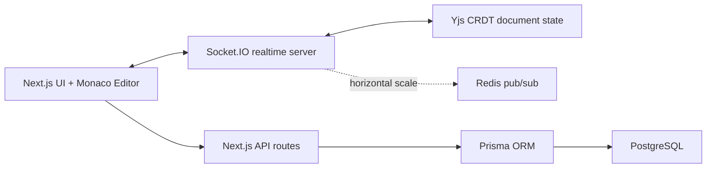

# ReviewSync

ReviewSync is a realtime collaborative code review platform for teams that need Google Docs-style editing, inline review workflows, version history, and role-based access in one place.

The project is built to demonstrate full-stack engineering depth: realtime WebSocket sync, CRDT-based collaboration with Yjs, Monaco-powered code editing, review queues, suggestion approval, version diffs, activity feeds, and a production-ready PostgreSQL data model.

## Screenshots

### Realtime Review Workspace



### Collaborative Monaco Editor



### Version Timeline and Diff Viewer



### Review Queue



### Inline Suggestions



### Role-Based Access Control



## Core Features

- Realtime collaborative editing with Socket.IO and Yjs CRDT updates
- Monaco code editor with live presence and collaborator cursors
- Inline comments and review activity feed
- Review queue with approve, reject, and comment actions
- Suggested code changes with accept/reject workflow
- Version timeline with side-by-side diff viewer
- Role-based access control: owner, reviewer, viewer
- Autosave-ready local persistence for demo flows
- PostgreSQL/Prisma schema for production persistence
- Tests covering suggestion correctness and CRDT convergence

## Engineering Highlights

- **CRDT collaboration:** Yjs document updates converge across concurrent clients without central locking.
- **WebSocket sync:** Socket.IO rooms isolate document sessions and broadcast document/cursor updates.
- **Live presence:** active users, editing/viewing state, line numbers, and cursor labels are surfaced in the editor.
- **Versioning model:** versions store snapshots for diffing; this can scale to snapshots plus operation logs.
- **Review workflow:** comments, suggestions, approvals, rejections, and activity events are modeled separately from document content.
- **Cache isolation:** Next.js dev and production build outputs use separate folders to prevent local chunk corruption during development.

## Tech Stack

- **Frontend:** Next.js, React, TypeScript, Monaco Editor
- **Realtime:** Socket.IO, Yjs
- **Backend/API:** Next.js route handlers, Node.js realtime server
- **Database layer:** Prisma schema for PostgreSQL
- **Testing:** Vitest
- **Infra-ready:** Dockerfile, Docker Compose with PostgreSQL and Redis

## Architecture



## Local Development

Install dependencies:

```bash
npm install
cp .env.example .env
```

Run the app:

```bash
npm run dev:fresh
```

Open:

```text
http://localhost:3000
```

`dev:fresh` clears generated Next.js caches, then starts both the Next.js app and realtime WebSocket server.

## Useful Commands

```bash
npm run dev:fresh
npm run test
npm run build
npm run prisma:generate
docker compose up -d
```

Important: stop the dev server before running `npm run build`. The project separates dev and build outputs (`.next-dev` and `.next-build`) to avoid Next.js generated-chunk conflicts.

## Resume-Ready Summary

Built a realtime collaborative code review platform with Monaco editing, WebSocket presence, Yjs CRDT synchronization, inline comments, suggestion approvals, role-based access, version history, side-by-side diffs, and PostgreSQL-backed data modeling.
