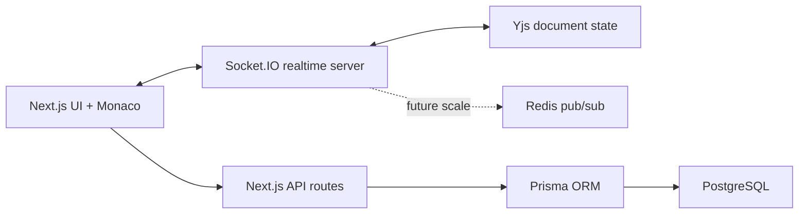

# ReviewSync

Realtime collaborative code review and docs platform built for systems-heavy portfolio depth.

## Features

- Realtime collaborative editing with Socket.IO and Yjs CRDT updates
- Monaco-based code editor with language-aware editing
- Inline review comments tied to line numbers
- Suggested changes with approve/reject flow
- Role model for owner, reviewer, and viewer
- Version snapshots and diff viewer
- Document search and in-file search
- Prisma/PostgreSQL schema for production persistence
- Focused tests for suggestion correctness and Yjs convergence

## Architecture



## Local Development

```bash
npm install
cp .env.example .env
npm run dev:all
```

Open `http://localhost:3000`.

The current UI runs with demo documents so it is easy to try without a database. Auth routes and Prisma schema are included for the Postgres-backed path.

## Useful Commands

```bash
npm run test
npm run build
npm run prisma:generate
docker compose up -d
```

## Engineering Notes

- Yjs updates are binary CRDT updates, so concurrent edits converge without a central lock.
- The client seeds initial content only when the server document is empty, preventing duplicate bootstrap content across tabs.
- Suggestions are modeled separately from document content so reviewers can approve or reject without mutating the main file until accepted.
- Versions store full snapshots for simple diffing; a production scale-up could use periodic snapshots plus operation logs.
